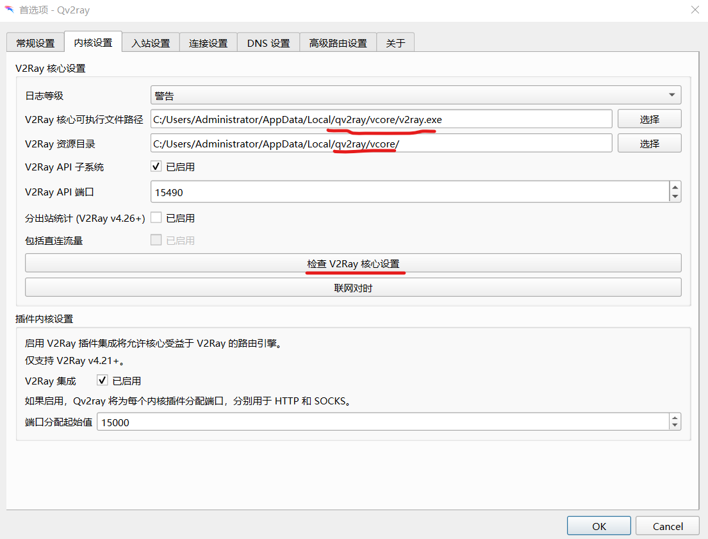
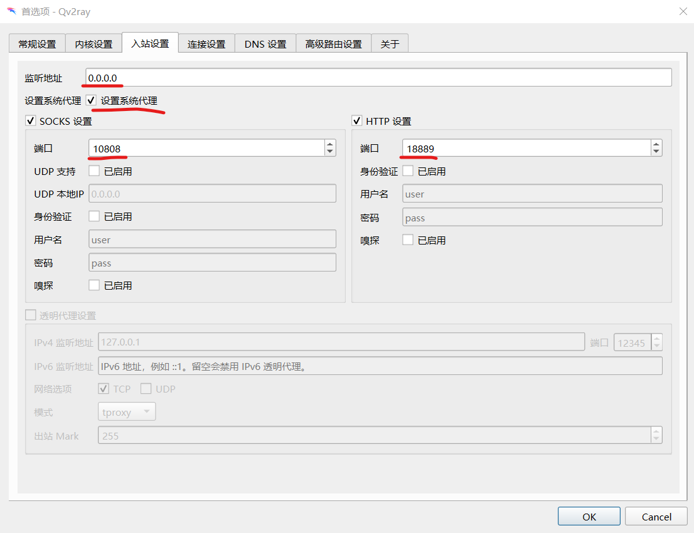

# 在 WIndows10 利用 WSL2 部署 Hyperledger Fabric 开发环境

## 准备工作

#### VPN

1.  下载并安装[Qv2ray](https://github.com/Qv2ray/Qv2ray/releases)，加速代理自行购买

2.  下载 [V2ray-core](https://github.com/v2ray/v2ray-core/releases)，重命名为 *vcore* 并在 Qv2ray 中安装

    

3.  如果使用 SSR 需要另行安装 [Qv2ray-SSR 插件](https://github.com/Qv2ray/QvPlugin-SSR/releases)

    

4.  设置 Qv2ray 选项

    

    

#### WSL

1.  开启服务：程序与功能中开启 Hyper-V、虚拟机平台及 Linux 子系统，重启

2.  下载实例：Microsoft Store 中下载 Ubuntu-20.04，然后打开初始化设置用户密码

3.  下载并安装 [WSL2 内核](https://aka.ms/wsl2kernel)

4.  升级到 WSL2：

    ```powershell
    wsl -l -v
    wsl --set-version Ubuntu-20.04 2
    wsl --set-default-version 2
    ```

#### 镜像加速

1.  apt 清华源

    ```shell
    sudo nano /etc/apt/sources.list
    ```

    注释掉或者删掉原本的 ubuntu 的官方源，注意 docker 那一行不要误删掉，替换成以下：

    ```
    # 默认注释了源码镜像以提高 apt update 速度，如有需要可自行取消注释
    deb https://mirrors.tuna.tsinghua.edu.cn/ubuntu/ focal main restricted universe multiverse
    # deb-src https://mirrors.tuna.tsinghua.edu.cn/ubuntu/ focal main restricted universe multiverse
    deb https://mirrors.tuna.tsinghua.edu.cn/ubuntu/ focal-updates main restricted universe multiverse
    # deb-src https://mirrors.tuna.tsinghua.edu.cn/ubuntu/ focal-updates main restricted universe multiverse
    deb https://mirrors.tuna.tsinghua.edu.cn/ubuntu/ focal-backports main restricted universe multiverse
    # deb-src https://mirrors.tuna.tsinghua.edu.cn/ubuntu/ focal-backports main restricted universe multiverse
    deb https://mirrors.tuna.tsinghua.edu.cn/ubuntu/ focal-security main restricted universe multiverse
    # deb-src https://mirrors.tuna.tsinghua.edu.cn/ubuntu/ focal-security main restricted universe multiverse
    ```

    Ctrl+X -> Y 退出编辑，然后：

    ```shell
    sudo apt update
    sudo apt-get update
    ```

2.  docker 阿里云源

    打开阿里云[容器镜像服务页](https://cn.aliyun.com/product/acr)获取自己的加速地址，然后执行：

    ```shell
    sudo mkdir -p /etc/docker
    sudo tee /etc/docker/daemon.json <<-'EOF'
    {
      "registry-mirrors": ["https://0zw1g36i.mirror.aliyuncs.com"]
    }
    EOF
    ```

#### 软件源添加

1.  Docker

    ```shell
    # 安装工具让apt可以支持HTTPS方式获取包
    sudo apt install apt-transport-https ca-certificates curl software-properties-common
    # 将官方Docker库的GPG公钥添加到系统中
    curl -fsSL https://download.docker.com/linux/ubuntu/gpg | sudo apt-key add -
    # 将Docker库添加到apt里
    sudo add-apt-repository "deb [arch=amd64] https://download.docker.com/linux/ubuntu bionic stable"
    # 再次更新下apt库列表
    sudo apt update
    # 开始安装docker-ce
    sudo apt install docker-ce
    
    # 安装完成查询版本号
    docker --version
    # 为 docker 添加当前用户
    sudo service docker start
    sudo usermod -aG docker $USER
    # 开始安装docker-compose
    sudo apt install docker-compose
    
    # 安装完成后查询docker-compose版本号
    docker-compose --version
    ```

2.  Golang

    ```shell
    sudo add-apt-repository ppa:longsleep/golang-backports
    sudo apt-get update
    sudo apt-get install golang
    
    ```
    
    设置 golang 环境变量，先查看 golang 安装路径
    
    ```shell
    $ whereis go
    go: /usr/bin/go /usr/lib/go /usr/share/go /usr/lib/go-1.15/bin/go /usr/share/man/man1/go.1.gz
    ```
    
    新建 GOPATH
    
    ```shell
    mkdir ~/GOPATH
    ```
    
    修改 .bashrc：
    
    ```shell
    nano ~/.bashrc
    ```
    
    在文件末尾添加:
    
    ```shell
    export GOROOT=/usr/lib/go # GOROOT是系统上安装 Go 软件包的位置。
    export GOPATH=/home/<your username>/GOPATH # GOPATH 是刚刚新建的工作目录的位置。
    export PATH=$GOPATH/bin:$GOROOT/bin:$PATH
    ```
    
    激活 .bashrc 并设置 go 代理
    
    ```shell
    source  ~/.bashrc
    go version
    sudo go env -w GO111MODULE=on
    sudo go env -w GOPROXY=https://goproxy.cn,direct
    ```

## 后续工作

#### 配置 WSL root 账户

1.  设置好 root 密码

    ```shell
    sudo passwd root
    ```

2.  修改 ssh 配置

    ```shell
    sudo nano /etc/ssh/sshd_config
    ```

    找到对应行进行修改

    ```yaml
    # ...
    Port 22
    # ...
    PermitRootLogin yes
    # ...
    PasswordAuthentication yes
    # ...
    ```

    初始化 ssh-key

    ```shell
    sudo ssh-keygen -A
    ```

    启动 ssh 服务

    ```shell
    sudo service ssh start
    ```

#### WSL2 自动设置静态 IP

由于 WSL2 网络适配器基于 NAT，每次重启都会重新设置 IP，这对于代理加速、SSH 连接以及程序开发调试都很不方便，因此需要在 Windows 启动时自动设置静态 IP

1.  安装 net tools

    ```shell
    sudo apt install net-tools
    ```
    
2.  新建 init_wsl.bat 文件：

    ```powershell
    @echo off
    :: Add an IP address in Ubuntu, 192.168.50.16, named eth0:1
    wsl -d Ubuntu-20.04 -u root ip addr add 192.168.50.16/24 broadcast 192.168.50.255 dev eth0 label eth0:1
    :: Add an IP address in Win10 for vEthernet Adapter, 192.168.50.88
    netsh interface ip add address "vEthernet (WSL)" 192.168.50.88 255.255.255.0
    :: Close the cmd window
    taskkill /f /im cmd.exe
    exit
    ```

    以管理员执行，查看结果：

    Windows：

    ```powershell
    >ipconfig
    ...
    ...
    以太网适配器 vEthernet (WSL):
    
       连接特定的 DNS 后缀 . . . . . . . :
       本地链接 IPv6 地址. . . . . . . . : fe80::ed0c:5235:19e2:d81d%48
       IPv4 地址 . . . . . . . . . . . . : 192.168.32.1
       子网掩码  . . . . . . . . . . . . : 255.255.240.0
       IPv4 地址 . . . . . . . . . . . . : 192.168.50.88
       子网掩码  . . . . . . . . . . . . : 255.255.255.0
    ```

    WSL：

    ```shell
    $ ifconfig
    ...
    
    eth0:1: flags=4163<UP,BROADCAST,RUNNING,MULTICAST>  mtu 1500
            inet 192.168.50.16  netmask 255.255.255.0  broadcast 192.168.50.255
            ether 00:15:5d:c6:d5:d6  txqueuelen 1000  (Ethernet)
    ...
    ```

    此时可以通过 192.168.50.16 在 Windows访问 Ubuntu，通过 192.168.50.88 在 Ubuntu 访问 Windows

3.  win 快捷键 + R 打开运行，输入：shell:startup，打开 Windows 开机自动运行目录，将 set_ip.bat 拷贝到此目录下

4.  重启 Windows 测试一下

#### WSL2 设置加速代理

1.  修改 .bashrc

    ```shell
    nano ~/.bashrc
    ```

    在文件末尾添加：

    ```shell
    alias sp='export http_proxy=http://192.168.50.88:18889' # http 代理
    alias sps='export https_proxy=socks5://192.168.50.88:10808' # https 代理
    alias usp='unset http_proxy' # 取消 http 代理
    alias usps='unset https_proxy' # 取消 https 代理
    alias cip='curl cip.cc' # 测试 http 代理 IP
    alias cips='curl ipinfo.io' # 测试 https 代理 IP
    ```

    激活 .bashrc

    ```shell
    source  ~/.bashrc
    ```

2.  测试代理，查看 ip 测试结果

    ```shell
    sp
    sps
    cip
    cips
    ```

#### 设置服务自动启动

1.  新建 /etc/init.wsl 文件：

    ```shell
    #! /bin/sh
    /etc/init.d/ssh start $1
    /etc/init.d/docker start $2
    ```

2.  添加权限

    ```shell
    sudo chmod +x /etc/init.wsl
    ```
    
3.  修改 init_wsl.bat 文件，添加一行：

    ```powershell
    @echo off
    :: Add an IP address in Ubuntu, 192.168.50.16, named eth0:1
    wsl -d Ubuntu-20.04 -u root ip addr add 192.168.50.16/24 broadcast 192.168.50.255 dev eth0 label eth0:1
    :: Add an IP address in Win10 for vEthernet Adapter, 192.168.50.88
    netsh interface ip add address "vEthernet (WSL)" 192.168.50.88 255.255.255.0
    :: start ssh and docker service
    wsl -u root /etc/init.wsl
    :: Close the cmd window
    taskkill /f /im cmd.exe
    exit
    ```

## 部署 Fabric 环境

#### 安装依赖软件

```shell
sudo apt install python3 python nodejs npm
```

#### 安装 Fabric

1.  下载 [bootstrap.sh](https://raw.githubusercontent.com/hyperledger/fabric/master/scripts/bootstrap.sh)，使用 ftp 传到 WSL 中

2.  开启加速代理，启动 docker 服务，执行脚本

    ```shell
    sp
    sps
    sudo service docker start
    mkdir ~/Project
    cd ~/Project
    bash ~/bootstrap.sh -s -d
    sudo bash ~/bootstrap.sh -s -b
    ```

3.  下载完成之后目录会出现 bin/ 和 config/ 文件夹

    ```shell
    sudo cp bin/* /usr/bin/
    # 执行以下不出错则配置成功
    configtxgen version  
    configtxlator version 
    cryptogen version 
    fabric-ca-client version 
    fabric-ca-server version 
    idemixgen version 
    orderer version 
    peer version
    discover --help
    ```
    
4.  测试

    参考 [test-network](https://hyperledger-fabric.readthedocs.io/en/latest/test_network.html)
    
    ```shell
    cd ~/Project/
    git clone -b v2.1.1 https://github.com/hyperledger/fabric-samples
    cd fabric-samples
    cp ../bin -r ./bin
    cp ../config -r ./config
    cd test-network/
    sudo ./network.sh -h
    ```
    
    参考官方测试流程即可
    
    **到此，WSL2 Fabric 环境部署完成**
## 配置 Fabric Win 开发环境

#### Go 开发环境

1.  安装 Golang
2.  配置 Go 环境变量
3.  安装 Go-SDK

#### 配置远程调试环境

#### 测试开发环境