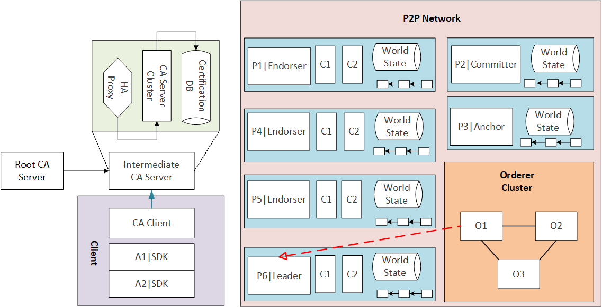
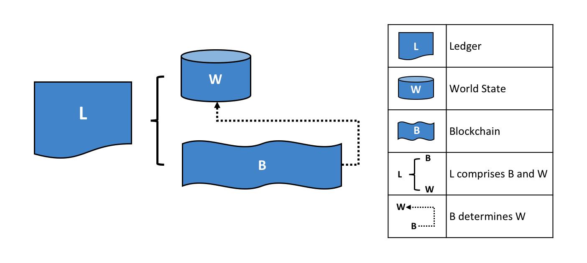
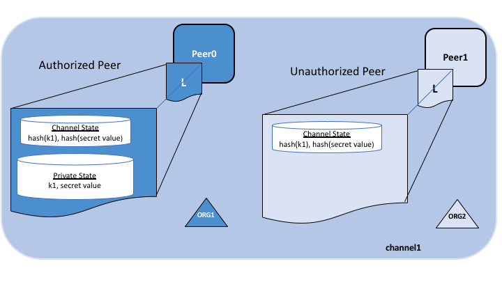
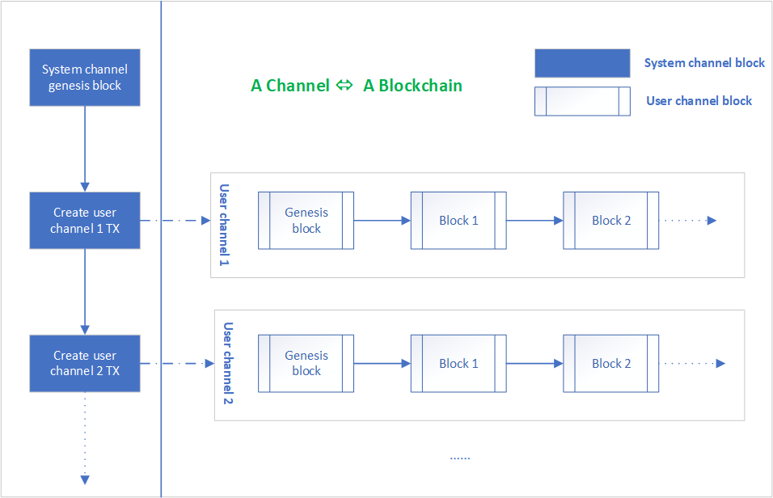
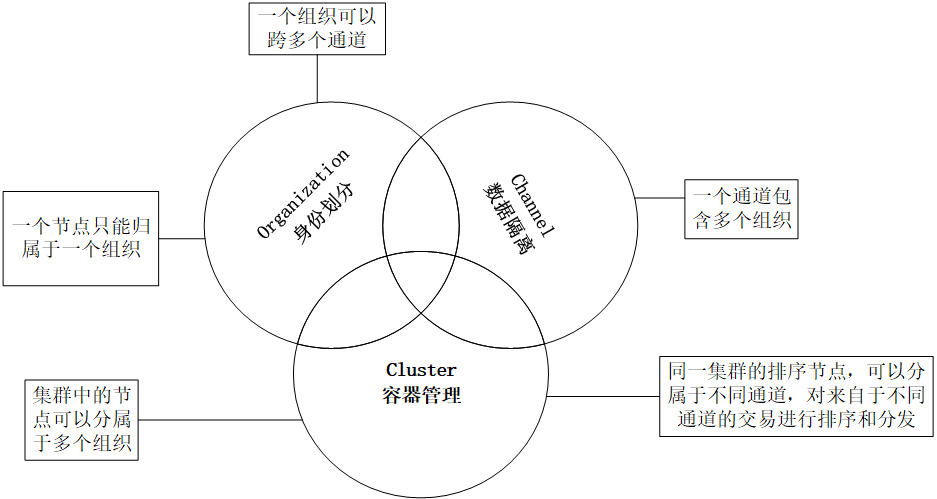

# Fabric Network: Runtime Architecture

## Content

[TOC]

再叙述下面的内容之前，我想说一下自己关于 Fabric 框架学习的一点想法。

Fabric 网络是整个 Fabric 框架中最核心的部分，也是第一道拦路虎，同时还是最难啃的一块骨头。

可以这样说，如果彻底搞懂了 Fabric 网络，那之后的合约开发和应用开发简直就像喝水一样简单。

但是，彻底搞懂谈何容易，本部分内容不仅十分冗杂，且难度颇高，其涉及到的核心原理与扩展技术想要彻底弄明白需要下很大的功夫，如对于原理部分的排序策略以及交易和区块传播中涉及到各种协议；再如对于技术部分的 CA、各种策略配置、集群、数据库的使用等。

所以，对于 Fabric 框架学习，我本人有三个原则：

1. 思路清晰。在学习时一定要在通篇浏览的基础上，构建自己的学习路线，拥有一个清晰的学习思路。Fabric 网络部分的内容，我打算拆分成两块，一是网络的架构介绍，阐述网络中的各种角色及角色之间的关系，二是网络中交易流程的详细介绍，说明各种角色在一次交易流程中所要承担的各种职责，及每种职责触发的各种事件。即整体的学习路线为：

   

2. 懂得取舍。由于内容繁杂丰富，所以初始阶段不太深究那些过于详实的内容，如协议、算法的细节，配置文件的详细字段含义等。在需要深入学习时，会通过专题的形式来做深入的学习。

3. 优先实践。再难的框架，用它手动编写一个应用后，都可以学会个大概。

## Architecture Overview

图中展示了 *Fabric* 的网络架构，整个网络大致上划分成了两个区域，**对等网络**区域和**用户客户端**区域。网络中包括了四种角色，分别为：**Peer**、**Orderer**、**CA **和 **Client**，这些都是具体的实体。

**Peer **是账本和链码的载体，负责向客户端应用发出事件。它存在着四种类型，分别为：**Committer**、**Endorser**、**Anchor **和 **Leader**。关于对等节点的详细结构与各种类型节点之间的联系和区别，后面会做具体介绍。

**Orderer** 承担着依照排序策略对交易和区块进行排序、打包、分发的工作。对等网络中的排序节点（无论这些排序阶段是否同属于一个通道），往往会通过建立排序节点集群来对其统一集中管理。

**CA** 是 *Fabric* 网络中的证书机构，它承担了所有涉及到身份注册、认证和管理等与证书相关的操作。它采取了 *C/S* 架构，为了扩展性，**CA Server**可分为**Root CA Server**和**Multi-level Intermediate CA Server**。类似于排序节点，CA 中间服务端也大多采用集群来管理，而且，为了满足高并发的要求，集群还会采取添加 **HA Proxy**的方式来做负载均衡，证书被统一存储在集群中的**证书数据库**中。

**Client** 的第一个身份是**Application Client**，它是 *Fabric* 网络服务的使用者，其通过 *Fabric* 提供的 **SDK** 编写应用或是直接通过 **Fabric Cli** 来向 *Fabric* 网络发起各种交易请求。它的另一个身份是 **CA Client**，在访问 *Fabric* 网络服务前需要通过中间 CA 服务端的认证接入网络。

其实这些实体之间还存在着一些复杂的关系，这些关系主要包括如下三种：**Channel**、**Organization**和 **Cluster**。通常情况下，一个通道中包含着多个组织，每个组织内存在着一定数目的对等节点、排序节点、CA 和客户端，而集群往往是脱离前两者来说的，集群是为了便于技术人员对网络进行管理而引入的一种额外的关系，也就是说，*Fabric* 网络中可以没有集群。

但是这三者的关系又不仅仅如此简单，三者之间彼此之间都具有交叉的部分，后面会做详细阐述。

## Roles

#### Peer

- **Committer**：提交节点，还称为记账节点。负责执行链码（如果部署了的话），存储账本，并对收到的区块验证有效后存储到账本。

- **Endorser**：背书节点。具备提交节点的功能，不同的是，首先背书节点上一定已经部署了链码，且其可以接受客户端应用发来的交易提案，并模拟交易，最后向客户端返回模拟交易的链码调用执行结果。

- **Anchor**：锚节点。具备提交节点的功能，负责向外部（指的是本通道内其它组织中的节点）提供本组织内其它节点的发现服务。

- **Leader**：具备提交节点的功能，与排序节点相连接，负责接收来自排序节点的交易并广播给本组织内的其它节点。

- **Endorser Proxy**：背书节点上每个链码在实例化时可以指定一个背书策略来引用一组背书节点，即这个链码仅会在这些被指定的节点上部署。客户端在发起交易提案时会根据待调用链码的背书策略，将交易提案发给对应的背书节点。背书节点再根据提案中的链码调用请求对链码执行相应的调用，向客户端返回其签名和背书结果等信息，但是此时不写入执行结果。客户端根据收到各背书节点的签名、背书结果后，验证签名和背书结果是否满足背书策略等。

  上面只是背书节点和链码级背书策略在整个交易流程中经历的部分，对于完整的交易流程会在 *Fabric* 网络第二节的*交易流程*中详细介绍。

  另外也可以在通道实例化或者升级对应链码时设置背书策略，这个过程称为设置键级别的背书策略，不过目前还用不着深入了解。

  背书策略的通用形式为：

  ***`P = {AND(P1, P2, P3), OR(P1, P2, P3), OutOf(m, P1, P2, .., Pi, .., Pn), m <= n}`***

  `P` 指的是策略, 由最基本的三种策略组成。`P` 是可以嵌套的。

  注意 `OR` 策略要慎重选择，有一节点作恶就会导致严重后果。

  对于 `OutOf`，`m` 指的是需要节点签名背书的数量，即 `n` 个背书节点至少需要 `m` 个节点的签名背书。

- **Chain Code**：这里只是简要的阐述一下链码生命周期涉及到的一些内容，详细的会在链码开发那部分介绍。在之前的 [*Overview*](./[2020.12.07]Fabric Overview.xmind) 部分中，已经说明了链码要经历生命周期的四个阶段，这里就不再阐述。

- **Ledger**：关于账本，[Fabric 官方文档)](https://hyperledger-fabric.readthedocs.io/zh_CN/release-2.2/ledger/ledger.html#账本)介绍的十分明了，这里引用一下：

  > **世界状态**存储了与业务对象当前状态相关的事实信息，而**区块链**是一种历史记录，它记录了这些业务对象是如何到达各自当前状态的相关事实。区块链记录了每个账本状态之前的所有版本以及状态是如何被更改的。
  
  我这里只阐述一下我自己的理解，并对一些扩展内容进行介绍。
  
  上一部分也提到过，通俗地说，账本由交易的 **Blockchain** 和交易的 **World State** 组成，可以把状态数据库视为交易在区块链中的索引，两者需要保持一致性。或是，更加精确一些，区块链存储了交易历史，而状态数据库则将这些交易历史中业务对象的状态信息提取保存。以便于使用，因为交易中，最终通常应用程序仅会对某一业务对象的状态进行操作。
  
  
  
  
  
  状态数据库，以 `KV` 的形式存储着一组账本状态，它可以随时对其进行 `CRUD`（*Create, read, update and delete*） 操作，而为了状态更新时的同步，每一对键值对表示的状态都带有一个字段名为 `version` 来实现**乐观锁**。
  
  区块链的结构是一群相互链接的区块的序列化日志，其中每个区块都包含一系列交易，各项交易代表了一个对世界状态进行的查询或更新操作。
  
  而关于区块和区块头部的结构，以及相关概念，篇幅限制，不做介绍，官方文档已经十分详细了。
  
- **Gossip Protocol**：是一种安全、可靠和可扩展的数据传播协议，用来保证数据的完整性和一致性。其内在机制比较复杂，详细情况可阅读[官方文档](https://hyperledger-fabric.readthedocs.io/zh_CN/release-2.2/gossip.html)和[此论文](http://arxiv.org/abs/1807.04938)，目前只介绍一下 Gossip 协议承担的主要任务，不对其细节做深入描述。

  > 基于 gossip 的数据传播协议在 Fabric 网络中有三个主要功能：
  >
  > 1. 通过持续的识别可用的成员节点来管理节点发现和通道成员，还有检测离线节点。（**发现服务**）
  > 2. 向通道中的所有节点传播账本数据。所有没有和当前通道的数据同步的节点会识别丢失的区块，并将正确的数据复制过来以使自己同步。（**数据传播和数据同步服务**）
  > 3. 通过点对点的数据传输方式，使新节点以最快速度连接到网络中并同步账本数据。（**点对点高速连接**）

- **Private Data**：即 *Fabric* 提供的**私有数据集合**功能，它允许在一个通道中通过**定义组织的子集对私有数据进行背书、提交或查询，而无需创建单独的通道**。

  这里只简单的介绍下，私有数据集合本身的相关概念，至于私有数据的交易流程，会在下一部分中详细介绍。

  借用一下 [Fabric 官方文档](https://hyperledger-fabric.readthedocs.io/zh_CN/release-2.2/private-data/private-data.html)的解释：

  > 私有数据集合是两个元素的组合:
  >
  > 1. **实际的私有数据**，通过 [Gossip 协议](https://hyperledger-fabric.readthedocs.io/zh_CN/release-2.2/gossip.html)点对点地发送给授权可以看到它的组织。私有数据保存在被授权的组织的节点上的私有数据库上，它们可以被授权节点的链码访问。排序节点不能影响这里也不能看到私有数据。注意，由于 gossip 以**点对点的方式**向授权组织分发私有数据，所以必须设置通道上的锚节点，也就是每个节点上的 `CORE_PEER_GOSSIP_EXTERNALENDPOINT` 配置，以此来引导跨组织的通信。
  > 2. **该数据的 hash 值**，该 hash 值被背书、排序之后写入通道上每个节点的账本。Hash 值作为交易的证明用于状态验证，并可用于审计。

  

  私有数据组合包括实际数据和数据的哈希，状态数据库只存储了私有数据的 KV 的对应哈希，区块链中关于私有数据的交易历史也只存储了数据的哈希。

#### Orderer

简单地说，排序节点负责的就是对打包到一个区块内的多个交易进行排序及对链接到区块链上的多个区块进行排序。

你可能会问：排序指的是什么？为什么要排序？如何去排序？好的，一个一个地来解答。

排序即决定交易打包和区块链接的先后顺序，这与如比特币此类的挖矿过程本质上是一样的，只不过由于传统**基于概率的共识机制**是**非确定的**，区块在链接到链上时会产生分叉，而 *Fabric* 的设计依赖于**确定性的共识机制**，对等节点所验证的交易和区块都是最终确定的和正确的。这种确定性由一组排序节点提供的排序服务来实现。

对来自客户端的交易，根据排序策略，要么舍弃，要么首先将交易打包为区块，在将区块分发给连接到的该通道内的主节点，最后由主节点在本组织内广播区块。

> **总的来说，排序节点为客户端和对等节点提供了一个可靠的共享的消息通道，在这个通道中，包含交易的信息以原子通信的方式传递，使得消息以相同逻辑（即排序策略，或可称为共识协议）的顺序传递到对等节点，在分布式系统中可达成全序广播/原子广播/共识。**

所以，**排序即是共识**，而进行排序的理由就是**保证交易被打包或是区块被链接时的确定性**。除此以外，**排序节点将排序和背书分离**，与传统的区块链网络结构相比，*Fabric* 网络更具伸缩性，消除了部分性能上的瓶颈。

排序节点除了提供排序服务，**还承担着与通道创建和访问控制相关的任务**，这里不去详谈。

在 1.4 版本中，*Fabric* 提供了三种排序策略，分别为：**Solo**、**Kafka** 和 **Raft**，前两者在 2.x 版本中被弃用。关于三者的详细原理，此处不做过多介绍。额外注意，由于排序策略是可插拔的，除了以上三种，开发者也可以自己定义排序策略。

#### CA

正如前文所说，**CA** 分为 **CA Server** 和 **CA Client**，**Server** 又分为 **Root Server** 和 **Multi-level Intermediate Server**，由此多级 CA 最终会构成一条**信任链**。这种多级结构，为 *Fabric* 网络提供了巨大的灵活性。

**成员服务提供者**（*MSP*）将由 CA 实现了的分发证书、验证证书和用户授权背后的所有加密机制和协议统统抽象出来，MSP 实际上就是 CA 向外提供的接口。根据 MSP 接口，开发者可以自己定义身份概念，同样也可以定义管理(身份验证)和认证(签名生成和验证)这些身份的规则。MSP 为 Fabric 网络提供了成员操作的模块化以及不同成员标准和架构之间的互操作性。

关于 CA 大部分篇幅在于实践，因此在之后的开发流程部分再对 `CA` 做进一步介绍。

#### Client

至于 **Client**，只需要了解到它的两种身份：**Application Client** 和 **CA Client**，其中主要关注应用客户端和基于 **SDK** 的应用开发，在之后会结合实践作详细介绍。

## Relationships

#### Channel

在 *Fabric* 网络中，可以把**通道**视为计算机网络中的**“子网”**，类似的，通道所起到的作用可以概括为：基于**数据隔离**和保密构建的一个**私有区块链**。

通道分为**系统通道**和**用户通道**。可使用 SDK 或直接通过调用 Fabric Cli 来生成系统通道，创建**创世区块**，初始化系统通道，关于创世区块的结构和存储的配置信息，这里不做介绍。也可通过同样的方式来创建用户通道，创建用户通道的交易会被写入系统通道的账本中。

#### Organization

可以把一个**组织**视为计算机网络中的**“局域网”**，在 Fabric 中称之为**信任域**。

组织代表了一个通道中关于成员身份的划分，一个通道中的这些组织共同构成了一个**“联盟”**。

通常情况下，每个组织内均会包含前面提及的全部角色，包括客户端。

#### Cluster

引用[计算机集群 - 维基百科](https://zh.wikipedia.org/zh-hans/计算机集群)里的一段解释：

> **计算机集群**（英语：computer cluster）是一组松散或紧密连接在一起工作的[计算机](https://zh.wikipedia.org/wiki/電子計算機)。由于这些计算机协同工作，在许多方面它们可以被视为单个系统。与[网格计算机](https://zh.wikipedia.org/wiki/网格计算)不同，计算机集群将每个[节点](https://zh.wikipedia.org/w/index.php?title=节点_(计算机科学)&action=edit&redlink=1)设置为执行相同的任务，由软件控制和调度。

前面已经提到了排序节点和中间 CA 服务端的集群，其实，只要是存在于 Fabric 网络中的容器、镜像或主机等节点，无论其是否处于同一组织甚至无论其是否处于同一通道，只要其所承担的**职责大致相同**，技术人员都可以按照自己的意愿选择其中任意的一组使用集群来管理。

通过引入**集群管理技术**，除了可以实现基础的**节点管理**，还可以完成**负载均衡**、**任务协同**等，这再一次提高了 Fabric 网络的性能和可用性。

上图是上述三种关系的韦恩图及一些描述。

## Conclusion

*Fabric* 网络是整个框架的核心，也是构建 *Fabric* 联盟链系统的基础设施。上文的介绍由整个网络的基本架构开始，对网络中各种角色和角色之间的关系做了详细的介绍。但是限于篇幅和学习路线安排，其实涉及到的比较深入的原理介绍和技术细节均只是简略提及，各位头脑中有个大概的印象即可，但是对于本文详细介绍的部分，希望各位多加理解，这是继续进行之后所有工作的基础和重中之重。另外，对于部分内容，如果不甚了解，可以自行查询搜索引擎或是组织好问题后提出。